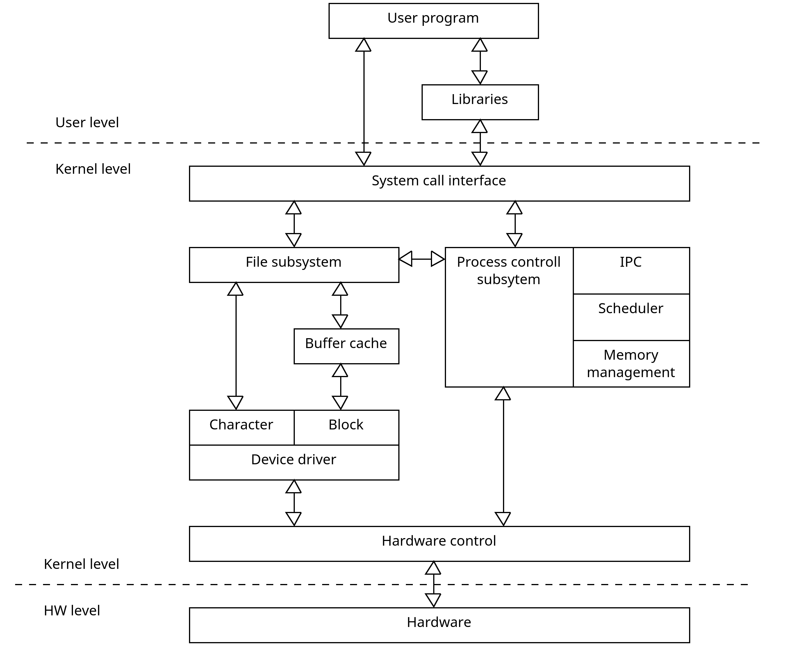
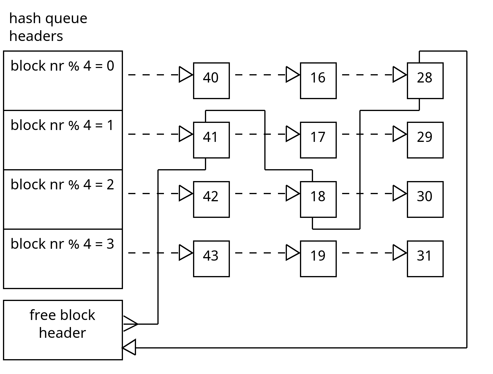
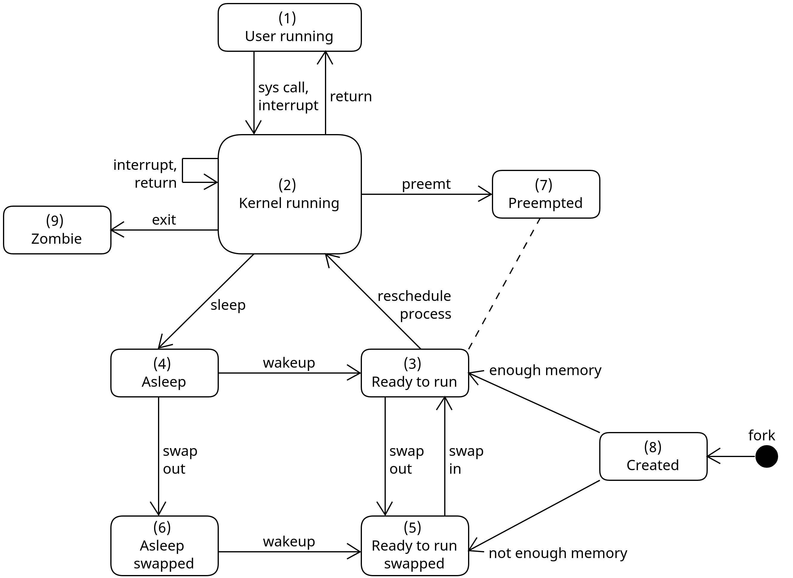

# Unix design
Based on the book "The design of the unix operating system" by Maurice J. Bach

## Intruduction

## The file system
A file system is a sequence of logical block, each containig 512, 124 or any multiple of 512 Byte. Block size is homogeneaus within a file system.
A file system has 4 parts:
- **Boot block:** may contain the bootstap code
- **Super block:** state of the file system
    - how large
    - storage capacity
    - where to find free space
- **Inode list:** one inode is the root inode of the system
- **Data blocks:** an allocated block can belong to one and only one file in the file system

### Buffer cache
At system initialization, the kernel allocates free space for buffers.
A buffer consists of two parts:
- A memory array
- A buffer header

The buffer is a memory copy of a disk block.

A buffer header consist of 8 values:
- Device number
- Block number
- Status
    - locked
    - valid data
    - delayed write
    - busy
    - old
    - ...
- Pointer to data
- Pointer to next buffer header on hash queue
- Pointer to previous buffer header on hash queue
- Pointer to next buffer header on free list
- Pointer to previous buffer header on free list

The status "delayed write" is used to minimise the IO operations to the disk. The data stays as long as possible in the buffer.

The main algorithms for managing the buffer cache are:
- get block
- release buffer
- read block
- read block and read ahead

get block algorithm:
~~~
input:  file system number
        block number
output: locked buffer ready to use 
{
    while (buffer not found) 
    {
        if (buffer busy)
        {
            sleep (event: buffer becomes free);
            continue;
        }
        mark buffer busy;
        remove buffer from free list;
        return buffer;
    }
    else
    {
        if (no buffer on free list)
        {
            sleep (event: any buffer becomes free);
            continue;
        }
        remove buffer from free list;
        if (buffer marked for delayed write)
        {
            asynchronus write buffer to disk;
            continue;
        }
        remove buffer from old hash queue;
        put buffer to new hash queue;
        return buffer;
    }
}
~~~

release buffer algorithm:
~~~
input:  locked buffer
output: none
{
    wakeup processes event: any buffer becomes free;
    wakeup processes event: buffer becomes free;
    inhibite interrupts;
    if (buffer status valide and buffer status not old)
    {
        enqueue buffer at end of free list;
    }
    else
    {
        enqueue buffer at beginn of free list;
    }
    allow interrupts;
    unlock (buffer);
}
~~~

read block algorithm:
~~~
input:  file system number
        block number
output: buffer containing data
{
    getbuffer (file system and block number);
    if (buffer data valide)
    {
        return buffer;
    }
    initiate disk read;
    sleep (event: disk read complete);
    return buffer;
}
~~~

read block and read ahead algorithm:
~~~
input:  file system block number for immediate read
        file system block number for asychronus read
output: buffer for immediate read
{
    if (first block not in cache)
    {
        get buffer for first block;
        if (buffer data not valid)
        {
            initiate disk read;
        }
        if (second block not in cache)
        {
            get buffer for seconde block;
            if (buffer data valid)
            {
                release buffer
            }
            else
            {
                initiate disk read;
            }
        }
        if (first block was originally in cache)
        {
            read first block;
            return buffer;
        }
        sleep (event: first buffer contains valid data);
        return buffer;
    }
}    
~~~

## Process
A process can run in two different modes:
- user mode
- kernel mode

User and kernel mode uses two different stack.

